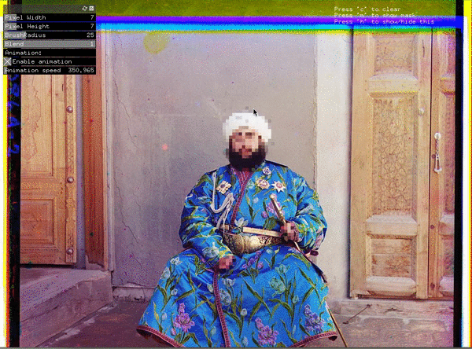

Face Glitch
============

A collab with [@arielkitch](http://twitter.com/arielkitch) to make a face pixelator.

;

Setup
-----

This project was built with [**openFrameworks 0.9.0**](http://blog.openframeworks.cc/post/133076054194/openframeworks-090-major-changes) for osx, which you can [download here](http://www.openframeworks.cc/versions/v0.9.0/of_v0.9.0_osx_release.zip). It was built using XCode 6.4.

### Addons

This project uses the following addons:

 * [ofxGui](http://openframeworks.cc/documentation/ofxGui/introduction.html) (comes installed with openFrameworks)

References
-----------

### openFrameworks

 * [oF site](http://openframeworks.cc/)
  * [documentation](http://openframeworks.cc/documentation/)
  * [tutorials](http://openframeworks.cc/tutorials/)
 * [oF book](https://github.com/openframeworks/ofBook) an in-progress book about openFrameworks
 * [oF on GitHub](https://github.com/openframeworks/openFrameworks)

### Shaders / GLSL

 * [Introducing Shaders](http://www.openframeworks.cc/tutorials/graphics/shaders.html) is an oF-specific shader tutorial.
 * [The Book of Shaders](http://patriciogonzalezvivo.com/2015/thebookofshaders/) by Patricio Gonzalez
 * [`ofShader`](http://openframeworks.cc/documentation/gl/ofShader.html) documentation
 * Examples
  * [shaderExample](https://github.com/openframeworks/openFrameworks/tree/master/examples/gl/shaderExample)
  * [Examples from "Introducing Shaders" tutorial](https://github.com/openframeworks/openFrameworks/tree/master/tutorials/shader)
  * [Shadertoy](https://www.shadertoy.com/)

Todo
-----

 - [ ] Add image open
 - [ ] Add image save
 - [ ] Zooming
 - [ ] Full screen mode
 - [ ] Other glitch effects?